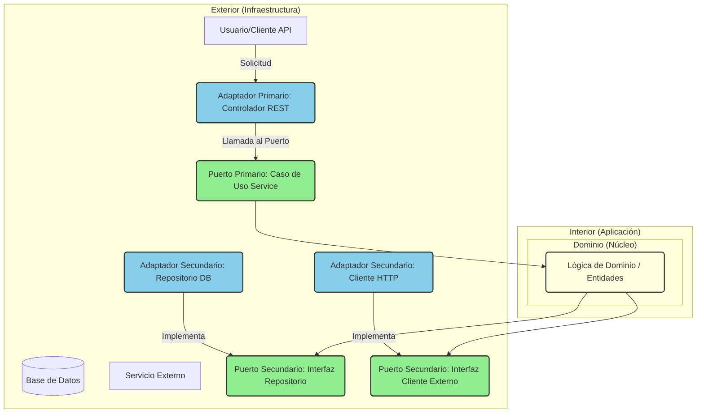

## Introducción

La arquitectura hexagonal, también conocida como arquitectura de puertos y adaptadores, es un patrón de diseño de software que tiene como objetivo crear sistemas de software débilmente acoplados, fácilmente comprobables y mantenibles. Propuesta por Alistair Cockburn, esta arquitectura enfatiza la separación de intereses aislando la lógica de negocio central de las preocupaciones de infraestructura.

En este artículo, exploraremos en detalle la arquitectura hexagonal, sus componentes clave, cómo implementarla y las ventajas y desventajas que ofrece. Aprenderás cómo este enfoque puede ayudarte a construir aplicaciones más robustas y flexibles.

## Contenido Principal

### ¿Qué es la Arquitectura Hexagonal?

La idea central de la arquitectura hexagonal es proteger el dominio de la aplicación de las dependencias externas. La aplicación se comunica con el mundo exterior a través de "puertos", que son interfaces que definen cómo interactuar con la lógica de negocio. Las implementaciones de estos puertos se denominan "adaptadores", que traducen las solicitudes externas en llamadas a la lógica de negocio y viceversa.

El término "hexagonal" no implica que haya exactamente seis lados o componentes. Simboliza la idea de que hay múltiples puntos de entrada y salida (puertos) en la aplicación, permitiendo que diversos tipos de clientes o sistemas interactúen con ella.

### Componentes Clave

1.  **Dominio (Núcleo de la Aplicación):**
    *   Contiene la lógica de negocio pura y las reglas.
    *   No depende de ninguna tecnología específica de infraestructura (bases de datos, frameworks UI, etc.).
    *   Es el corazón de la aplicación.

2.  **Puertos:**
    *   Son interfaces definidas por el dominio.
    *   Representan los contratos de comunicación entre el dominio y el mundo exterior.
    *   Existen dos tipos principales de puertos:
        *   **Puertos Primarios (Driving Ports):** Utilizados por actores que inician la interacción con la aplicación (e.g., controladores de API, interfaces de usuario). Definen cómo la aplicación es impulsada por el exterior.
        *   **Puertos Secundarios (Driven Ports):** Utilizados por la aplicación para interactuar con servicios externos (e.g., bases de datos, servicios de mensajería, APIs de terceros). Definen cómo la aplicación impulsa a los servicios externos.

3.  **Adaptadores:**
    *   Son implementaciones concretas de los puertos.
    *   Se encuentran fuera del dominio y dependen de él.
    *   Traducen la comunicación entre el formato específico de una tecnología externa y el formato requerido por los puertos del dominio.
    *   Ejemplos de adaptadores:
        *   **Adaptadores Primarios (Driving Adapters):** Controladores REST, adaptadores de GraphQL, clientes de línea de comandos.
        *   **Adaptadores Secundarios (Driven Adapters):** Adaptadores de base de datos (ORM, JDBC), clientes HTTP para APIs externas, adaptadores de colas de mensajes.

### Diagrama de la Arquitectura


*Diagrama: Componentes de la Arquitectura Hexagonal.*

### Ejemplo de Implementación en Código (Conceptual)

Imaginemos un servicio para gestionar tareas.

**1. Dominio:**

```typescript
// domain/task.ts
export interface Task {
  id: string;
  title: string;
  completed: boolean;
}

// domain/ports/TaskRepository.ts
export interface TaskRepository {
  findById(id: string): Promise<Task | null>;
  save(task: Task): Promise<void>;
  findAll(): Promise<Task[]>;
}

// domain/ports/TaskService.ts (Puerto Primario)
export interface TaskService {
  createTask(title: string): Promise<Task>;
  getTask(id: string): Promise<Task | null>;
  completeTask(id: string): Promise<Task | null>;
  listTasks(): Promise<Task[]>;
}

// domain/usecases/TaskServiceImpl.ts
import { Task, TaskRepository, TaskService } from '../internal'; // Asumiendo barrel exports

export class TaskServiceImpl implements TaskService {
  constructor(private taskRepository: TaskRepository) {}

  async createTask(title: string): Promise<Task> {
    const task: Task = { id: Date.now().toString(), title, completed: false };
    await this.taskRepository.save(task);
    return task;
  }

  async getTask(id: string): Promise<Task | null> {
    return this.taskRepository.findById(id);
  }

  async listTasks(): Promise<Task[]> {
    return this.taskRepository.findAll();
  }

  async completeTask(id: string): Promise<Task | null> {
    const task = await this.taskRepository.findById(id);
    if (task) {
      task.completed = true;
      await this.taskRepository.save(task);
      return task;
    }
    return null;
  }
}
```

**2. Adaptadores:**

```typescript
// infrastructure/adapters/inMemoryTaskRepository.ts (Adaptador Secundario)
import { Task, TaskRepository } from '../../domain/internal';

export class InMemoryTaskRepository implements TaskRepository {
  private tasks: Map<string, Task> = new Map();

  async findById(id: string): Promise<Task | null> {
    return this.tasks.get(id) || null;
  }

  async save(task: Task): Promise<void> {
    this.tasks.set(task.id, task);
  }

  async findAll(): Promise<Task[]> {
    return Array.from(this.tasks.values());
  }
}

// infrastructure/adapters/taskController.ts (Adaptador Primario - Ejemplo con Express)
/*
import { Request, Response } from 'express';
import { TaskService } from '../../domain/ports/TaskService';

export class TaskController {
  constructor(private taskService: TaskService) {}

  async createTask(req: Request, res: Response): Promise<void> {
    try {
      const { title } = req.body;
      if (!title) {
        res.status(400).json({ message: 'Title is required' });
        return;
      }
      const task = await this.taskService.createTask(title);
      res.status(201).json(task);
    } catch (error) {
      res.status(500).json({ message: 'Error creating task', error });
    }
  }

  async getTask(req: Request, res: Response): Promise<void> {
    // ... implementación similar ...
  }
}
*/
```

**3. Composición (Ejemplo):**

```typescript
// main.ts o app.ts
/*
import express from 'express';
import { TaskServiceImpl } from './domain/usecases/TaskServiceImpl';
import { InMemoryTaskRepository } from './infrastructure/adapters/inMemoryTaskRepository';
import { TaskController } from './infrastructure/adapters/taskController';

const app = express();
app.use(express.json());

// Dependencias
const taskRepository = new InMemoryTaskRepository();
const taskService = new TaskServiceImpl(taskRepository);
const taskController = new TaskController(taskService);

// Rutas
app.post('/tasks', (req, res) => taskController.createTask(req, res));
// ... otras rutas ...

app.listen(3000, () => console.log('Server running on port 3000'));
*/
```

### Ventajas

*   **Testabilidad:** La lógica de negocio se puede probar de forma aislada, sin necesidad de frameworks o bases de datos. Los adaptadores también se pueden probar por separado.
*   **Mantenibilidad:** Los cambios en la infraestructura (e.g., cambiar de base de datos) solo afectan a los adaptadores, no al dominio.
*   **Flexibilidad:** Es fácil añadir nuevos adaptadores para soportar diferentes tipos de clientes o tecnologías.
*   **Independencia Tecnológica:** El núcleo de la aplicación no depende de tecnologías específicas, lo que reduce el acoplamiento y facilita la evolución.
*   **Separación Clara de Intereses:** Las responsabilidades están bien definidas.

### Desventajas

*   **Complejidad Inicial:** Puede parecer más complejo de configurar inicialmente en comparación con arquitecturas más simples como MVC.
*   **Mayor Número de Clases/Interfaces:** La abstracción a través de puertos puede llevar a un mayor número de artefactos de código.
*   **Curva de Aprendizaje:** El equipo necesita entender los principios de la arquitectura para aplicarla correctamente.

## Caso Práctico

Imaginemos que nuestra aplicación de gestión de tareas necesita exponer una API REST y, más adelante, una interfaz de línea de comandos (CLI). Además, inicialmente usa una base de datos en memoria para desarrollo, pero en producción usará PostgreSQL.

**Flujo con API REST:**

1.  Un cliente HTTP envía una petición POST a `/tasks` con `{ "title": "Comprar leche" }`.
2.  El **Adaptador Primario** (Controlador Express) recibe la petición.
3.  El Controlador llama al método `createTask("Comprar leche")` del **Puerto Primario** (`TaskService`).
4.  La implementación del `TaskService` (`TaskServiceImpl`) crea una nueva entidad `Task`.
5.  `TaskServiceImpl` llama al método `save(task)` del **Puerto Secundario** (`TaskRepository`).
6.  El **Adaptador Secundario** (`PostgresTaskRepository` o `InMemoryTaskRepository`) implementa `save(task)` y persiste la tarea en la base de datos correspondiente.
7.  La respuesta viaja de vuelta a través de las capas hasta el cliente.

*Diagrama de Secuencia (Placeholder):*
`[Insertar diagrama de secuencia para creación de tarea vía API REST]`

**Añadiendo un Adaptador CLI:**

*   Se crea un nuevo **Adaptador Primario** (`TaskCLIAdapter`) que parsea comandos de la línea de comandos (e.g., `task create "Regar plantas"`).
*   Este adaptador llama a los mismos métodos del `TaskService` que el controlador REST.
*   El dominio no cambia.

**Cambiando de Base de Datos:**

*   Se crea un nuevo **Adaptador Secundario** (`PostgresTaskRepository`) que implementa `TaskRepository`.
*   En la configuración de la aplicación (composición), se instancia `PostgresTaskRepository` en lugar de `InMemoryTaskRepository`.
*   El dominio y los adaptadores primarios no cambian.

*Captura de Pantalla (Placeholder):*
`[Insertar captura de pantalla de la estructura de carpetas del proyecto]`

## Conclusión

La arquitectura hexagonal es un patrón poderoso para construir aplicaciones robustas, mantenibles y escalables. Al centrarse en la separación de la lógica de negocio de las preocupaciones de infraestructura mediante puertos y adaptadores, facilita las pruebas, la evolución tecnológica y la adición de nuevas formas de interactuar con la aplicación.

Si bien puede introducir una complejidad inicial, los beneficios a largo plazo en términos de flexibilidad y mantenibilidad suelen superar este costo, especialmente para aplicaciones de tamaño mediano a grande.

### Próximos Pasos y Recursos Adicionales

*   Investiga sobre Domain-Driven Design (DDD), que complementa bien la arquitectura hexagonal.
*   Explora implementaciones de referencia en tu lenguaje de programación preferido.
*   Lee el artículo original de Alistair Cockburn sobre Puertos y Adaptadores.

[Enlace a la documentación oficial o artículo de Cockburn (Placeholder)]
[Enlace a un artículo relacionado sobre DDD (Placeholder)]

### Llamado a la Acción

¿Has implementado la arquitectura hexagonal en tus proyectos? ¡Comparte tu experiencia en los comentarios!
