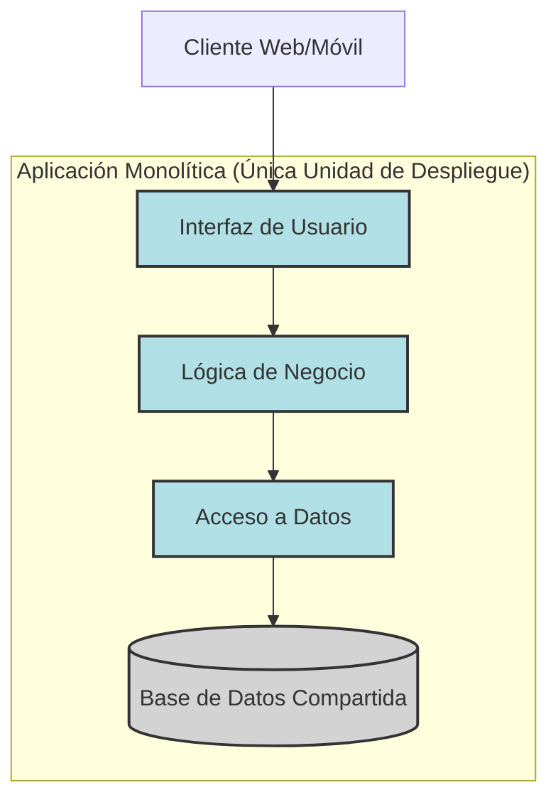

## Introducción

La elección de la arquitectura de software es una de las decisiones más críticas al iniciar un nuevo proyecto o al evolucionar uno existente. Dos de los enfoques arquitectónicos más discutidos son los **Monolitos** y los **Microservicios**. Cada uno tiene sus propias ventajas, desventajas y casos de uso ideales. Entender estas diferencias es crucial para tomar una decisión informada que se alinee con los objetivos del negocio y las capacidades del equipo.

En este artículo, exploraremos en profundidad ambas arquitecturas, compararemos sus características clave y ofreceremos una guía para ayudarte a decidir cuál es la más adecuada para tu próximo proyecto.

## Contenido Principal

### ¿Qué es una Arquitectura Monolítica?

Una arquitectura monolítica es el enfoque tradicional para construir aplicaciones. En un monolito, todos los componentes de la aplicación (interfaz de usuario, lógica de negocio, acceso a datos, etc.) están interconectados y son interdependientes, formando una única unidad de despliegue.

**Características Clave:**
*   **Unidad Única:** Toda la aplicación se construye y despliega como un solo artefacto (e.g., un archivo WAR, JAR, un único ejecutable).
*   **Base de Código Compartida:** Todos los módulos comparten la misma base de código.
*   **Desarrollo Simplificado (Inicialmente):** Más fácil de desarrollar, probar y desplegar en las etapas iniciales del proyecto.
*   **Comunicación Interna Directa:** Los componentes se comunican a través de llamadas a funciones o métodos dentro del mismo proceso, lo cual es rápido y simple.

**Diagrama de Arquitectura Monolítica:**

*Diagrama: Estructura típica de una aplicación monolítica.*

### ¿Qué es una Arquitectura de Microservicios?

Una arquitectura de microservicios estructura una aplicación como una colección de servicios pequeños, autónomos y débilmente acoplados. Cada servicio se enfoca en una capacidad de negocio específica y se puede desarrollar, desplegar y escalar de forma independiente.

**Características Clave:**
*   **Servicios Independientes:** La aplicación se divide en múltiples servicios pequeños.
*   **Despliegue Autónomo:** Cada servicio se puede desplegar de forma independiente.
*   **Tecnologías Diversas:** Cada servicio puede usar diferentes tecnologías (lenguajes de programación, bases de datos) según sus necesidades.
*   **Escalabilidad Selectiva:** Se pueden escalar individualmente los servicios que lo requieran.
*   **Resiliencia:** Un fallo en un servicio no necesariamente derriba toda la aplicación (si se diseña correctamente).
*   **Comunicación entre Procesos:** Los servicios se comunican a través de la red, típicamente usando APIs HTTP/REST, gRPC o colas de mensajes.

**Diagrama de Arquitectura de Microservicios:**
```mermaid
graph TD
    Cliente[Cliente Web/Móvil] --> APIGW(API Gateway)

    subgraph "Aplicación Basada en Microservicios"
        APIGW --> SvcA[Servicio A (e.g., Usuarios)]
        APIGW --> SvcB[Servicio B (e.g., Pedidos)]
        APIGW --> SvcC[Servicio C (e.g., Productos)]

        SvcA --> DB_A[(Base de Datos A)]
        SvcB --> DB_B[(Base de Datos B)]
        SvcC --> DB_C[(Base de Datos C)]

        SvcB -.->|Llamada API/Mensaje| SvcC
        SvcB -.->|Llamada API/Mensaje| SvcA
    end

    style APIGW fill:#FFD700,stroke:#333,stroke-width:2px
    style SvcA fill:#98FB98,stroke:#333,stroke-width:2px
    style SvcB fill:#98FB98,stroke:#333,stroke-width:2px
    style SvcC fill:#98FB98,stroke:#333,stroke-width:2px
    style DB_A fill:#D3D3D3,stroke:#333,stroke-width:2px
    style DB_B fill:#D3D3D3,stroke:#333,stroke-width:2px
    style DB_C fill:#D3D3D3,stroke:#333,stroke-width:2px
```
*Diagrama: Estructura típica de una aplicación de microservicios.*

### Comparativa Detallada: Monolitos vs Microservicios

| Característica        | Monolito                                       | Microservicios                                         |
|-----------------------|------------------------------------------------|--------------------------------------------------------|
| **Desarrollo**        | Más simple al inicio, complejidad crece con el tiempo. | Mayor complejidad inicial, más manejable a largo plazo. |
| **Despliegue**        | Unidad única, más simple. Redeployar todo por un cambio. | Múltiples unidades, más complejo. Despliegue selectivo. |
| **Escalabilidad**     | Escalar toda la aplicación. Puede ser ineficiente. | Escalar servicios individuales. Más eficiente.        |
| **Pila Tecnológica**  | Generalmente una sola tecnología.              | Libertad para elegir la mejor tecnología por servicio. |
| **Aislamiento Fallos**| Un fallo puede afectar toda la aplicación.     | Un fallo en un servicio puede aislarse.             |
| **Gestión de Datos**  | Única base de datos, consistencia más fácil.   | Bases de datos por servicio, consistencia distribuida. |
| **Complejidad**       | Menor complejidad inicial, mayor a medida que crece. | Mayor complejidad operativa (red, monitorización).   |
| **Tamaño del Equipo** | Adecuado para equipos pequeños y medianos.      | Puede facilitar equipos más grandes y distribuidos.    |
| **Tiempo de Arranque**| Generalmente más lento para la aplicación completa. | Servicios individuales arrancan más rápido.          |
| **Pruebas**           | Pruebas de extremo a extremo más simples.        | Pruebas de extremo a extremo más complejas. Pruebas unitarias por servicio más simples. |
| **Comunicación**      | En proceso (rápida).                           | Entre procesos (más lenta, sobrecarga de red).       |

### Ejemplos de Arquitectura

**Monolito - Aplicación de Blog Simple:**
*   `BlogController.java`: Maneja peticiones web.
*   `PostService.java`: Lógica para crear, leer, actualizar, borrar posts.
*   `CommentService.java`: Lógica para comentarios.
*   `User.java`, `Post.java`, `Comment.java`: Entidades JPA.
*   Todo empaquetado en `blog.war` y desplegado en un Tomcat. Usa una única base de datos MySQL.

**Microservicios - Plataforma E-commerce:**
*   **Servicio de Usuarios:** Gestiona perfiles de usuario, autenticación. (Node.js + MongoDB)
*   **Servicio de Productos:** Catálogo de productos, inventario. (Python/Django + PostgreSQL)
*   **Servicio de Pedidos:** Procesa órdenes, pagos. (Java/Spring Boot + Kafka + PostgreSQL)
*   **Servicio de Recomendaciones:** Genera recomendaciones de productos. (Python/Flask + Spark)
*   Cada servicio tiene su propio repositorio de código, pipeline CI/CD y base de datos.
*   Se comunican vía API Gateway (e.g., Kong) y mensajes (e.g., RabbitMQ/Kafka).

*Diagrama Comparativo (Placeholder):*
`[Insertar un diagrama que muestre lado a lado un sistema con arquitectura monolítica y el mismo sistema descompuesto en microservicios, resaltando las diferencias en estructura y comunicación.]`

### Cuándo Elegir Cada Uno

#### Cuándo Elegir un Monolito:

1.  **Equipos Pequeños:** Si tu equipo de desarrollo es pequeño, un monolito puede ser más fácil de gestionar.
2.  **Proyectos Nuevos / MVPs (Minimum Viable Product):** Para validar una idea de negocio rápidamente, un monolito permite un desarrollo más rápido al inicio.
3.  **Aplicaciones Simples:** Si la aplicación tiene una complejidad de dominio baja y no se espera una gran escala o variabilidad en la carga de sus componentes.
4.  **Experiencia Limitada:** Si el equipo no tiene experiencia con arquitecturas distribuidas.
5.  **Dominio de Negocio No Claro:** Cuando los límites del dominio aún no están bien definidos, un monolito puede ser más flexible para refactorizar inicialmente.

#### Cuándo Elegir Microservicios:

1.  **Aplicaciones Grandes y Complejas:** Cuando la aplicación es grande y puede dividirse lógicamente en dominios de negocio claros.
2.  **Necesidad de Escalabilidad Independiente:** Si diferentes partes de la aplicación tienen requisitos de escalabilidad muy diferentes.
3.  **Equipos Grandes y Distribuidos:** Permite que diferentes equipos trabajen de forma autónoma en diferentes servicios.
4.  **Diversidad Tecnológica Requerida:** Si deseas utilizar diferentes tecnologías para diferentes partes de la aplicación.
5.  **Alta Disponibilidad y Resiliencia:** Cuando es crucial que el fallo de un componente no afecte a toda la aplicación.
6.  **Ciclos de Despliegue Rápidos e Independientes:** Si necesitas poder actualizar partes de la aplicación frecuentemente sin redeployar todo.

**Consideraciones Importantes:**
*   **Complejidad Accidental:** Los microservicios pueden introducir mucha complejidad operativa (DevOps): orquestación de contenedores (Kubernetes), service discovery, circuit breakers, logging distribuido, tracing, etc.
*   **Monolito Modular (Majestic Monolith):** No todos los monolitos son "big balls of mud". Un monolito bien diseñado y modular puede ser una excelente opción y, a menudo, un buen punto de partida antes de considerar la transición a microservicios (estrategia "Monolith First").
*   **Costos:** Los microservicios pueden tener costos de infraestructura y monitoreo más altos.

## Caso Práctico: Evolución de una Startup de E-commerce

**Fase 1: MVP (Monolito)**
*   Una startup de e-commerce lanza su MVP con una arquitectura monolítica (Ruby on Rails).
*   Funcionalidades: Catálogo, Carrito, Checkout, Gestión de Usuarios.
*   Base de datos única (PostgreSQL).
*   Desarrollo rápido, equipo pequeño.

**Fase 2: Crecimiento y Primeros Problemas (El Monolito Crece)**
*   La plataforma gana tracción. Se añaden más funcionalidades: sistema de reseñas, panel de administración, integraciones con envíos.
*   El monolito se vuelve grande. Los tiempos de compilación y despliegue aumentan.
*   Escalar la base de datos se vuelve un cuello de botella. Un bug en el módulo de reseñas puede afectar el checkout.

**Fase 3: Transición a Microservicios (Decisión Estratégica)**
*   El equipo decide migrar gradualmente a microservicios.
*   **Primer paso:** Extraer el "Servicio de Productos" del monolito. El monolito ahora llama a este servicio vía API.
    *   *Diagrama de Flujo (Placeholder):* `[Diagrama mostrando el monolito original, y luego el monolito con el servicio de productos extraído, comunicándose vía API]`
*   **Pasos siguientes:** Extraer "Servicio de Usuarios", "Servicio de Pedidos", etc.
*   Se adopta Kubernetes para la orquestación, Istio para service mesh, Prometheus/Grafana para monitoreo.
*   Cada nuevo servicio puede elegir su propia pila tecnológica si es necesario.

**Fase 4: Madurez con Microservicios**
*   La plataforma es ahora una colección de microservicios.
*   Los equipos se especializan en dominios de negocio (equipo de catálogo, equipo de pagos).
*   Mayor resiliencia y escalabilidad granular.
*   Mayor complejidad DevOps, pero manejada por un equipo de plataforma dedicado.

*Captura de Pantalla (Placeholder):*
`[Captura de pantalla de una herramienta de monitoreo de microservicios como Kiali o Grafana mostrando un mapa de servicios]`

## Conclusión

No hay una respuesta única a la pregunta "Monolito vs Microservicios". La elección correcta depende del contexto específico de tu proyecto, equipo y objetivos de negocio.

*   **Los Monolitos** son una excelente opción para empezar, especialmente para MVPs y aplicaciones más pequeñas, ofreciendo simplicidad y velocidad de desarrollo inicial. Un monolito bien estructurado puede ser muy efectivo.
*   **Los Microservicios** brillan en aplicaciones grandes y complejas que requieren alta escalabilidad, flexibilidad tecnológica y desarrollo por equipos autónomos, pero vienen con una sobrecarga de complejidad operativa.

Considera un enfoque evolutivo: comienza con un monolito modular y considera la transición a microservicios solo cuando los beneficios superen claramente los costos y la complejidad añadida.

### Próximos Pasos y Recursos Adicionales

*   Lee "Building Microservices" de Sam Newman.
*   Investiga sobre "Monolith First" de Martin Fowler.
*   Explora patrones de diseño para microservicios (e.g., API Gateway, Circuit Breaker, Saga).
*   Considera tecnologías como Docker, Kubernetes, y service meshes (Istio, Linkerd).

[Enlace a "Building Microservices" (Placeholder)]
[Enlace al artículo "MonolithFirst" de Martin Fowler (Placeholder)]

### Llamado a la Acción

¿Qué arquitectura prefieres para tus proyectos y por qué? ¿Has tenido experiencias migrando de monolito a microservicios? ¡Comparte tu perspectiva en los comentarios!
